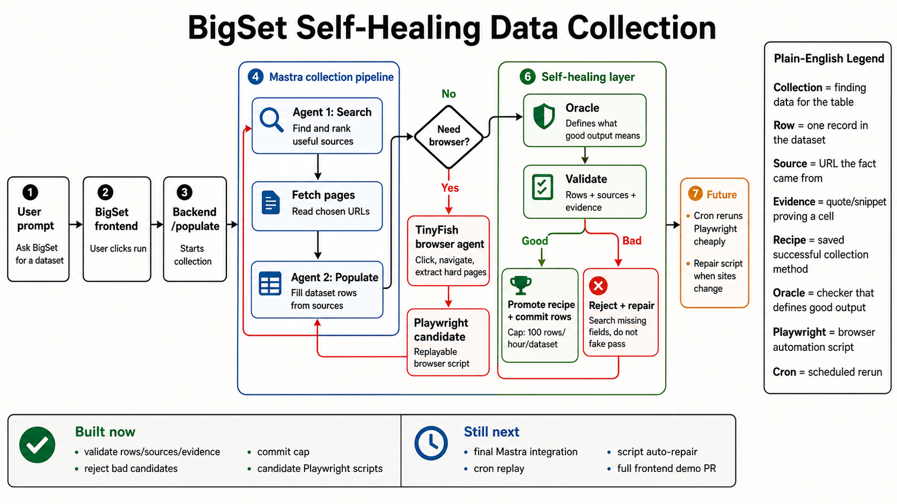

# Meeting Notes 6 Agent System Map

Source: summarized from latest local team-sync notes. This file is intentionally public-safe: no transcript paste, no private links, no secrets.

## Short Version

Team direction changed from "Mastra versus Mengzhe/data-collection-agent benchmark fight" to "move the useful data-collection-agent ideas into the Mastra app path."

Goal: one app-integrated collection system that can get around 100 useful rows, cite sources, avoid hallucinated rows, and eventually replay successful browser work with Playwright.

## Plain-English Image

## Action Items

1. Mastra owner should open a PR for the updated whole collection system by tomorrow so the team can check it out, run it, and test prompt-to-dataset in the BigSet frontend.
2. Mastra owner should send a simple detailed flowchart ASAP showing how the agent system works and where Edward's self-healing / Playwright work plugs in.
3. Mastra owner should raise extraction target toward about 100 rows and test whether the current pipeline can actually fill that many rows.
4. Mastra owner should improve the repair loop so it searches for missing fields/cells instead of blindly rerunning the same full cycle.
5. Mastra owner should add a browser/Playwright/TinyFish Agent stage for sources that normal fetch cannot read well.
6. Edward should explain the current self-healing and Playwright layer in a quick sync, especially whether it should be separate or part of the core pipeline.
7. Team should confirm `make dev` setup and required env files at root, frontend, and backend.
8. Everyone should ask for help early if blocked. Weekend goal is a working integrated flow, not isolated demos.

## Mermaid Diagram

```mermaid
flowchart LR
  request["User asks BigSet for a dataset"]
  populate["BigSet app /populate"]

  subgraph mastra["Mastra collection pipeline"]
    search_agent["Agent 1: search and prioritize sources"]
    fetch_sources["Fetch selected sources"]
    browser_decision{"Need browser navigation?"}
    populate_agent["Agent 2: populate dataset rows"]
  end

  subgraph browser["Browser / Playwright stage"]
    tinyfish_agent["TinyFish Agent navigates site"]
    browser_actions["Explicit browser actions"]
    playwright_script["Playwright candidate script"]
    cron_future["Cron replay future"]
  end

  subgraph healing["Self-healing layer"]
    oracle["Oracle: defines good output"]
    validate["Validate rows, sources, evidence"]
    promote["Promote good recipe"]
    reject["Reject bad candidate"]
    commit_cap["Commit cap: 100 rows per hour per dataset"]
    repair["Repair missing fields across searches"]
  end

  request --> populate
  populate --> search_agent
  search_agent --> fetch_sources
  fetch_sources --> browser_decision
  browser_decision -->|"no"| populate_agent
  browser_decision -->|"yes"| tinyfish_agent
  tinyfish_agent --> browser_actions
  browser_actions --> playwright_script
  playwright_script --> populate_agent
  playwright_script -. "later" .-> cron_future

  populate_agent --> oracle
  oracle --> validate
  validate -->|"good"| promote
  promote --> commit_cap
  validate -->|"bad"| reject
  reject --> repair
  repair --> search_agent
```

## Plain English Vocabulary

Dataset request: user asks BigSet to make a table, like "find Amazon Starbucks products".

`/populate`: backend route that takes the request and runs data collection.

Mastra: app-integrated agent framework. This is the path the team wants to use as the main app path.

Data collection agent: Mengzhe's stronger older pipeline. Current plan is not to run it as a separate product forever; current plan is to move its good ideas into Mastra.

Search/prioritize agent: first agent. It finds possible sources and chooses which sources are worth fetching.

Fetch selected sources: normal HTTP/page fetch. Cheap and deterministic compared to a full browser agent.

Populate agent: second agent. It fills rows/cells using a fixed list of fetched sources, so it has less room to wander or hallucinate.

Browser navigation: when fetch is not enough because a site needs clicking, scrolling, store pages, tabs, throttled pages, or JavaScript.

TinyFish Agent: browser-capable agent that can navigate those harder pages.

Explicit browser actions: replayable steps from the browser run, like "go to this URL", "click K-Cup Pods", "extract product rows".

Playwright candidate script: generated script from those explicit browser actions. Candidate means "ready to inspect/test", not "trusted production cron yet".

Cron replay: future state where BigSet reruns the Playwright script cheaply on schedule instead of paying a full agent every time.

Oracle: self-healing word for "judge/contract". It defines what a good result must contain: expected fields, source backing, evidence, row quality.

Validate rows/sources/evidence: check whether rows are backed by real URLs/evidence and match the dataset request.

Promote recipe: save the successful method as reusable.

Reject candidate: do not save bad output as a good method. Benchmark should count this as failure, not fake success.

Repair loop: when output is missing/bad, use the failure details to search/fetch/populate missing pieces. Meeting notes specifically say repair should span searches, not just rerun the same thing.

Commit cap: safety limit before writing real rows. Current cap target is 100 rows per hour per dataset.

## What Is Built Versus Not Built

Built now:

- Self-healing wrapper concept exists around collection runs.
- It validates rows, source URLs, evidence, and expected entities.
- It promotes good recipes and rejects bad candidates.
- It caps real row commits.
- It emits Playwright-readiness diagnostics.
- It can generate a Playwright candidate script when explicit browser actions exist.

Not done yet:

- Mastra is not fully the one final integrated path.
- Browser/Playwright stage is not fully proven end to end inside Mastra.
- Cron replay is still future.
- Script auto-repair is still future.
- Repair loop still needs to search for missing fields across searches.

## How To Use This In Codex Sidebar

Open this file from the Changes/sidebar: `docs/meeting-notes-6-agent-system-map.md`.

To ask questions, select any line or block and ask Codex something like:

- "Explain this in dumb mode."
- "Where is this implemented?"
- "Is this built or planned?"
- "What PR owns this?"
- "What should I say in meeting?"

Use this file for comments/annotations. Do not annotate or share raw meeting notes; those are local/private context.

## Comment Anchors

Q1. Is Mastra now the only intended app path, or do we still keep standalone data-collection-agent runtime as fallback?

Q2. Should Playwright be a separate stage after source fetch, or should it be inside the core Mastra collection flow?

Q3. What exact signal decides "Need browser navigation?"

Q4. What fields does the oracle require for each benchmark prompt?

Q5. What is the minimum demo for tomorrow: PR checkout, `make dev`, prompt entered, rows shown, evidence visible?

Q6. What needs to happen before cron replay is safe?
