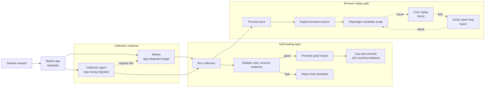
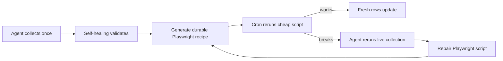

# Self-Healing Data Collection System

## One-Liner

BigSet now has a safety wrapper around data collection. It does not make the agent magically smarter; it prevents bad or unsupported output from being promoted, counted as success, or committed without guardrails.

## System Map

Raw Mermaid source lives in [`self-healing-data-collection-system.mmd`](./self-healing-data-collection-system.mmd).

## Components

- **Mastra**: the app-integrated agent framework path.
- **Collection agent**: the collection pipeline being migrated into the app-integrated framework path.
- **Self-healing layer**: runtime-agnostic safety wrapper around either collection path.
- **Process trace**: durable diagnostic trace of what happened during collection.
- **Explicit browser actions**: ordered browser work emitted by the producer, such as navigation, click, type, select, wait, and extract actions.
- **Playwright candidate script**: generated replay artifact from explicit browser actions. This is not a promoted cron recipe yet.

## What Works Now

- Run collection through the self-healing wrapper.
- Validate rows, source URLs, evidence, and expected entities.
- Promote or save only healthy recipes.
- Reject bad candidates.
- Count rejected candidates as benchmark failures.
- Commit real rows only after a successful tick.
- Cap real row commits at 100 rows/hour per dataset by default.
- Emit process trace and Playwright-readiness diagnostics.
- Preserve explicit browser actions when the producer emits them.
- Generate a bounded Playwright candidate script from explicit successful browser actions.

## What Is Not Done Yet

- Durable cron job that reruns the generated Playwright script.
- Auto-repair loop for broken Playwright scripts.
- Live key-backed canary proving browser-action readiness end to end.
- Final migration of collection-agent behavior into one app-integrated runtime path.

## Intended End State

## Review Notes

Use ` ` for line breaks inside Mermaid labels. Some renderers display backslash-n literally.

For sharing, paste the raw `.mmd` file into [Mermaid Live](https://mermaid.live), then export PNG or SVG.
